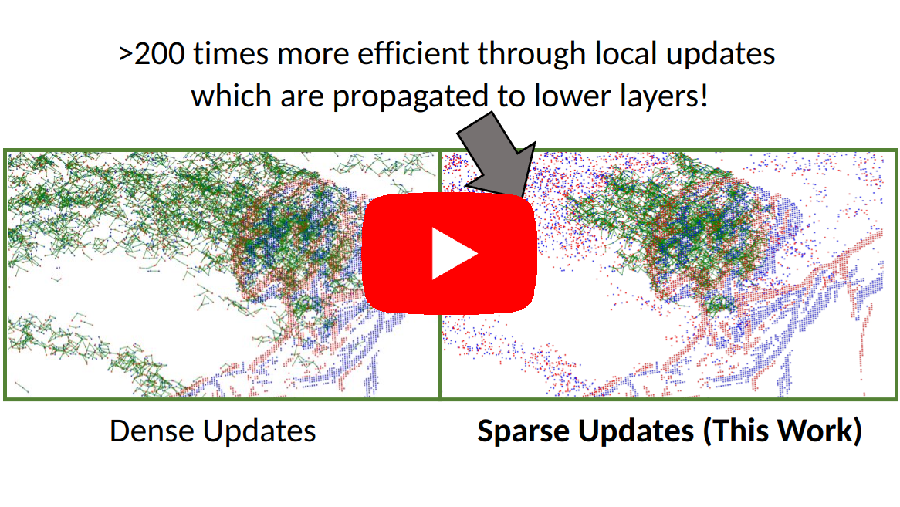

# AEGNN: Asynchronous Event-based Graph Neural Networks
<p align="center">
  <a href="https://youtu.be/opbFE6OsAeA">
    
  </a>
</p>

This repository contains code from our 2022 CVPR paper [**AEGNN: Asynchronous Event-based Graph Neural Networks**](http://rpg.ifi.uzh.ch/docs/CVPR22_Schaefer.pdf) by Simon Schaefer*, [Daniel Gehrig*](https://danielgehrig18.github.io/), and [Davide Scaramuzza](http://rpg.ifi.uzh.ch/people_scaramuzza.html). If you use our code or refer to this project, please cite it using 

```
@inproceedings{Schaefer22cvpr,
  author    = {Schaefer, Simon and Gehrig, Daniel and Scaramuzza, Davide},
  title     = {AEGNN: Asynchronous Event-based Graph Neural Networks},
  booktitle = {IEEE Conference on Computer Vision and Pattern Recognition},
  year      = {2022}
}
```

## Installation
The code heavily depends on PyTorch and the [PyG](https://github.com/pyg-team/pytorch_geometric) framework, which is 
optimized only for GPUs supporting CUDA. For our implementation the CUDA version 10.2 is used. Install the project
requirements with:
```
conda create -n aegnn python=3.8
conda activate aegnn
pip3 install torch==1.9.1
pip3 install torch-scatter torch-sparse torch-cluster torch-spline-conv -f https://data.pyg.org/whl/torch-1.9.1+cu102.html
pip3 install -r aegnn/requirements.txt
```

## Processing Pipeline
We evaluated our approach on three datasets. [NCars](http://www.prophesee.ai/dataset-n-cars/), 
[NCaltech101](https://www.garrickorchard.com/datasets/n-caltech101) and 
[Prophesee Gen1 Automotive](https://www.prophesee.ai/2020/01/24/prophesee-gen1-automotive-detection-dataset/).
Download them and extract them. By default, they are assumed to be in `/data/storage/`, this can be changed by setting
the `AEGNN_DATA_DIR` environment variable. 

### Pre-Processing
To efficiently train the graph neural networks, the event graph is generated offline during pre-processing. For 
specific instructions about the data structure and data pre-processing, please refer to the 
[dataset's readme](aegnn/datasets/README.md).

## Asynchronous & Sparse Pipeline
The code allows to make **any graph-based convolutional model** asynchronous & sparse, with a simple command and without 
the need to change the model's definition or forward function.
```
>>> import aegnn
>>> model = GraphConvModel()
>>> model = aegnn.asyncronous.make_model_asynchronous(model, **kwargs)
```
We support all graph convolutional layers, max pooling, linear layers and more. As each layer is independently 
transformed to work asynchronously and sparsely, if there is a layer, that we do not support, its dense equivalent 
is used instead. 

## Evaluation
We support automatic flops and runtime analysis, by using hooking each layer's forward pass. Similar to the 
`make_model_asynchronous()` function, among other, all graph-based convolutional layers, the linear layer and 
batch normalization are supported. As an example, to run an analysis of our model on the 
NCars dataset, you can use:
```
python3 aegnn/evaluation/flops.py --device X
```


## Contributing
If you spot any bugs or if you are planning to contribute back bug-fixes, please open an issue and
discuss the feature with us.
